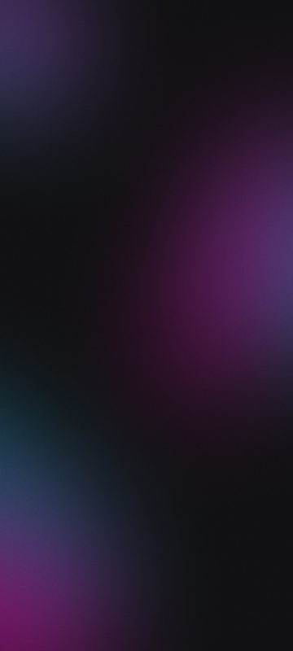

# 🌗 DevLinks - Switch de Tema

Um projeto simples e estiloso para treinar HTML, CSS e JavaScript, com foco na criação de um **switch de tema** (modo claro e escuro) e no uso de variáveis CSS.

## Funcionalidades

- Alternância entre **modo claro** e **modo escuro** ao clicar no switch.
- Botão que se movimenta da direita para a esquerda de acordo com o tema.
- Uso de **variáveis CSS** para mudar cores e imagens de fundo dinamicamente.
- Links para redes sociais e portfólio.
- Ícones modernos via [Ionicons](https://ionic.io/ionicons).

## Estrutura de Arquivos

┣ 📂 assets
┃ ┣ Avatar.png
┃ ┣ bg-mobile.jpg
┃ ┣ bg-desktop-light.jpg
┃ ┣ MoonStars.svg
┃ ┗ Sun.svg
┣ index.html
┣ style.css
┗ script.js


## Demonstração

### 🔒 Modo Escuro


### 🌞 Modo Claro


## 🚀 Como Usar

1. Clone este repositório:
   ```bash
   git clone https://github.com/seu-usuario/devlinks-theme-switch.git
